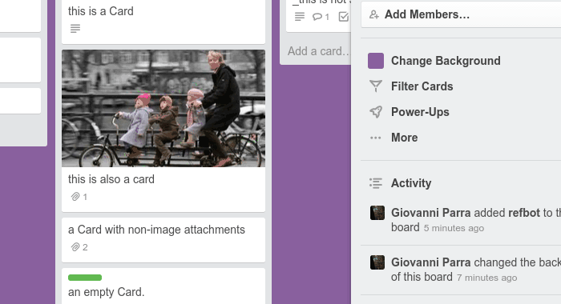

old description (from https://trello.com/refbot, now deleted):

> Hello, my name is **refbot** and I am a bot. I can monitor your board for you and add [GitHub Issues-style](https://github.com/blog/957-introducing-issue-mentions) backreferences to cards whenever they are mentioned in comments, descriptions or checklists from other cards.
> 
> _by [Websites for Trello](http://websitesfortrello.com/)_
> 
> 
> 
> You can just add me now to any of your boards and see how it works.
> 
> ---
> 
> * I am the creation of people at http://websitesfortrello.com/. When you add me to your private boards they will be able to see your data, but they won't do anything with it.
> 
> ---
> 
> * If you need my email for adding me, it is `refs@websitesfortrello.com`
> 
> ---
> 
> If you like me, check out my brother bots at http://websitesfortrello.com/trello-bots/

If want to deploy this, you'll need a Redis database, a Trello user to serve as the bot and some Trello API keys. Set the following environment variables:

  - `TRELLO_API_KEY`
  - `TRELLO_BOT_TOKEN`
  - `TRELLO_BOT_ID`
  - `SERVICE_URL`, full URL to your app, like https://myrefbot.com, without an ending slash
  - `REDIS_URL`, full URL with password, port etc.
